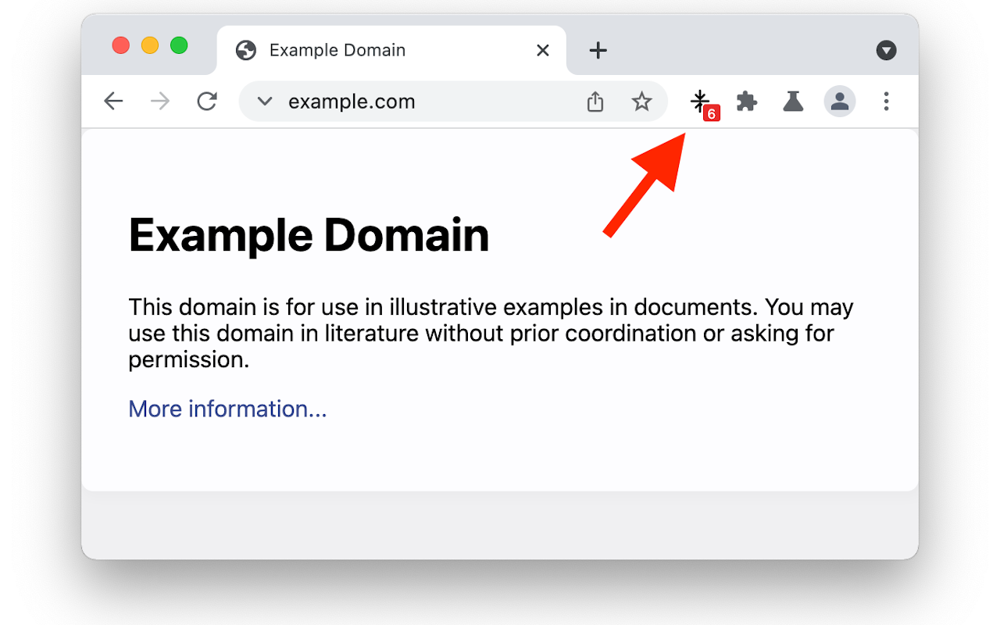

# chrome-extension-estimate-compression-level

## Synopsis

A Chrome browser extension that estimates the compression level of the
algorithm used to compress the page.

If you install the extension and then visit [https://www.example.com/](https://www.example.com/), you can see that the HTML page was compressed with level 6:



## Background

Compression is a core feature of HTTP that improves transfer speed,
cache bandwidth utilization and cache utilization.

Lossless data compression algorithms development led to the [LZW
algorithm](https://en.wikipedia.org/wiki/Lempel%E2%80%93Ziv%E2%80%93Welch)
(1984), used by the [`compress`
application](https://en.wikipedia.org/wiki/Compress) (1985), and then
the [PKZIP application](https://en.wikipedia.org/wiki/PKZIP) (1991)
with its [DEFLATE algorithm](https://en.wikipedia.org/wiki/Deflate)
which was then used in the [gzip
format](https://en.wikipedia.org/wiki/Gzip) (1992). The [zlib
library](https://en.wikipedia.org/wiki/Zlib) (1995) became a de facto
standard compression library for gzip data.

HTTP/1.1 in 1999 ([RFC 2616](https://datatracker.ietf.org/doc/html/rfc2616/#section-3.5)) added support for gzip, compress and
deflate compression as content encodings. gzip compression quickly
became the default as it compressed better than compress, which used
the [patented LZW algorithm](https://en.wikipedia.org/wiki/Lempel%E2%80%93Ziv%E2%80%93Welch#Patents), and as [Microsoft incorrectly implemented](https://stackoverflow.com/questions/9170338/why-are-major-web-sites-using-gzip/9186091#9186091)
deflate as a broken raw deflate stream instead of the correct deflate
stream inside a zlib format wrapper.

Compression algorithms generally define a file format and how to
decompress it. This allows the user to pick an appropriate compression
level: either fast compression, which compresses quickly, but doesn't
compress very small or instead best compression, which compresses
slowly but generates a smaller output.

With gzip and zlib these levels range from 1 (fast) to 9 (best), with a
default of 6.

When you browse to a page with this extension and the content is
compressed with gzip, a little badge is shown with the estimated
compression level.

If the compression was achieved with a gzip compressor other
than zlib, a fractional estimate of zlib compression level is shown.

## How does it work?

The chrome extension notes the `Content-Length` of the page as it is
loaded, then fetches the page again, tries to compress it with a
variety of levels and then displays the result.

This uses more network and CPU. Use sparingly.

## TODO

Some websites use the newer Brotli compression algorithm instead of gzip.
This extension does not support Brotli yet.

## Installation

Until this extension has been reviewed by Chrome Web Store team, which
can take several weeks, the only way to install this extension is to use
the development method below.

## Development

You should have access to the Fastly GitHub organization. Then run:

```bash
$ git clone git@github.com:fastly/chrome-extension-estimate-compression-level.git
Cloning into 'chrome-extension-estimate-compression-level'...
...
```

To use, visit chrome://extensions/ in your Chrome browser. Select
"Developer mode" then "Load an unpacked extension" and select the
chrome-extension-estimate-compression-level directory. You're all good
to go!

## Contributing

Send a pull request.

## License

The icon was based on "compress icon" from
[Iconoir](https://iconoir.com/), MIT license.

This extension is available as open source under the terms of the [MIT
License](http://opensource.org/licenses/MIT).

## Future

Is this useful? Let me know! Leon Brocard <<leon@fastly.com>>
